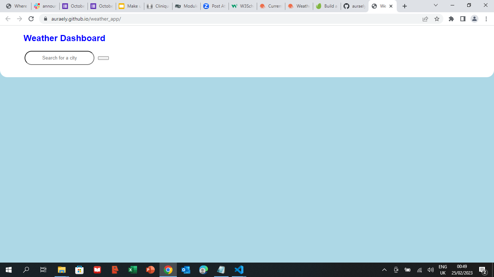

# weather_app

## Description

For this project, i was tasked to create a weather app that gives the forecast for the current day and the next 5 days in a particular city. For this app I have used HTML, CSS and Javascript and API.

## Instalation

The deployed link is :

https://auraely.github.io/weather_app/

## Usage

## Credits

N/A

## Licence

MIT
